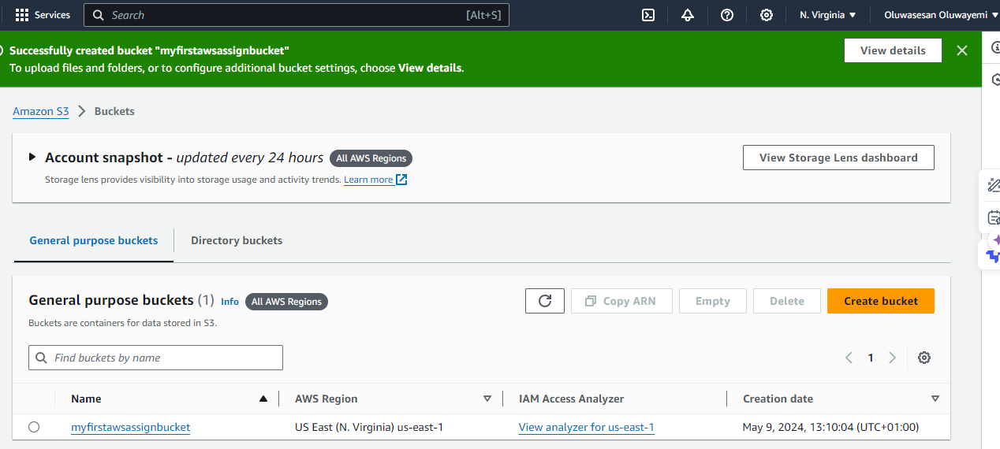
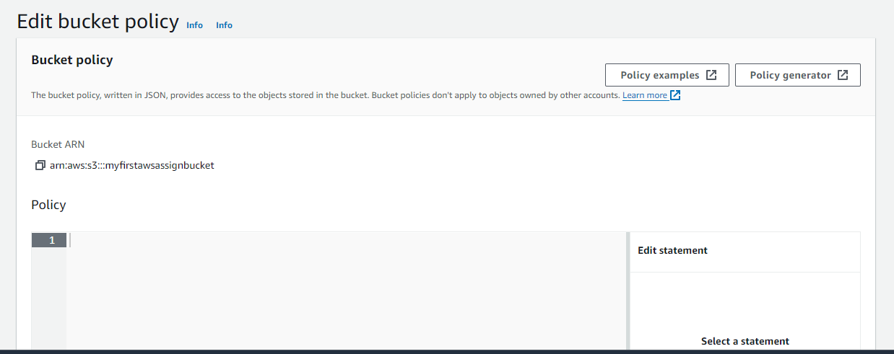

# ALTSCHOOL THIRD SEMESTER WITH CONRAD DURU
## ASSIGNMENT 1
#### 
Create a static website and host it on S3 bucket(private bucket) but with public read policy assigned, using cloud front for CDN. 

To be submitted on Saturday, latest 10am with screenshots of your Aws account bearing your name. 

Input your steps and screenshots in your README file on GitHub.

## SOLUTION-STEPS
### Prerequisite
1. already downloaded or created a static website
2. you have a working AWS account; if you don't, then go and create one before we get started

### STEP 1  CREATE BUCKET
Log into your AWS user console and search for s3 in the search bar on the console. then create a new s3 bucket.
 

Here we see that the s3 bucket has been created successfully.

### STEP 2  UPLOAD STATIC WEBSITE
now we upload our static website on the page, we can upload with add_file or add_folder any one that is applicable then we click on upload to upload the files and folders as the case may be.

Successful upload of my static website

### STEP 3  CONFIGURE BUCKET
now we set some configuartions starting with 
1. Properties: under properties we scroll down to Static website hosting and enable it.... then enter index.html in the index document then we save the changes.

2. Permissions: goto Block public access (bucket settings); and unblock all access. and then save the changes

Still under permission, we go to bucket policy and edit it, by adding s3 (get object) policy den save and exit

### cloud front
with cloud front, we can deploy the website with high latency and speed
1. Go to the AWS Management Console and navigate to CloudFront.

2. Click "Create Distribution".
3. Choose "Web" distribution.
4. For the Origin Domain Name, select your S3 bucket from the dropdown.
5. Click "Create Distribution".

### Time to test our website

Once the CloudFront distribution is deployed, test your website by accessing it through the CloudFront domain name displayed beside the created cloud front distribution.

